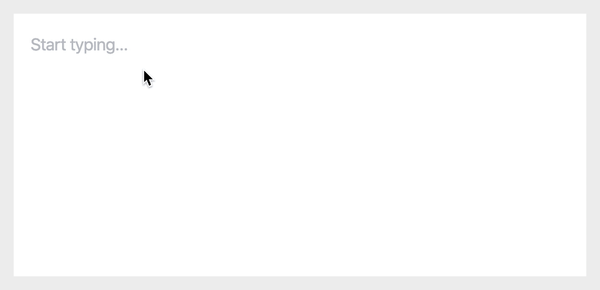

# Draft.js List Plugin

**Better lists for Draft.js**

- **Automatically creates lists when lines begin with `*`, `1.` or similar**
- **Allows creating nested lists using the tab key**
- Simple setup
- TypeScript type definitions

→ **[Demo](https://draft-js-list-plugin.samuelmeuli.com)**



## Usage

This plugin requires you to have [`draft-js-plugins`](https://github.com/draft-js-plugins/draft-js-plugins) set up in your project.

Install the plugin using NPM:

```sh
npm install draft-js-list-plugin
```

Import the list plugin in your Editor component:

```jsx
import React, { Component } from "react";
import PluginEditor from "draft-js-plugins-editor";
import createListPlugin from "draft-js-list-plugin";
// ...

const listPlugin = createListPlugin();
const plugins = [listPlugin];

export default class Editor extends Component {
	// ...

	render() {
		const { editorState } = this.state;

		return (
			<PluginEditor
				// ...
				editorState={editorState}
				plugins={plugins}
			/>
		);
	}
}
```

See [Editor.tsx](./demo/src/Editor.tsx) for a full example.

## Configuration

You can pass options to the plugin the following way:

```jsx
const listPlugin = createListPlugin({
	// Your options
});
```

Supported options:

- **`allowNestedLists`** (`boolean`): Whether the user should be able to create sublists (nested lists). Default: `true`
- **`maxDepth`** (`number`): Allows you to control how deep the list nesting can be. Default: `4`
- **`olRegex`** (`RegExp`): Regular expression for determining whether a numbered list should be started. Default: `/\d\./`
- **`ulChars`** (`string[]`): List of characters with which bullet lists can be started. Default: `["-", "–", "*"]`

## Development

Requirements: Node.js, Yarn

1. Clone this repository: `git clone REPO_URL`
2. Install all dependencies: `yarn`
3. Generate the library bundle: `yarn start`
4. View the demo on `localhost:3000`

Suggestions and contributions are always welcome! Please discuss larger changes via issue before submitting a pull request.
